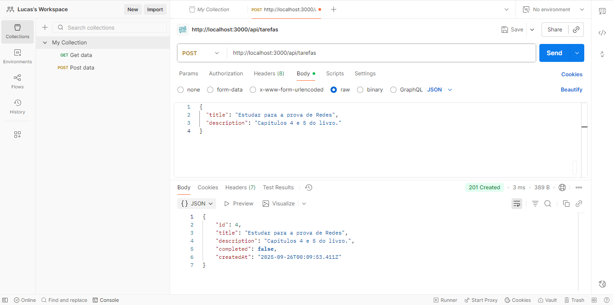
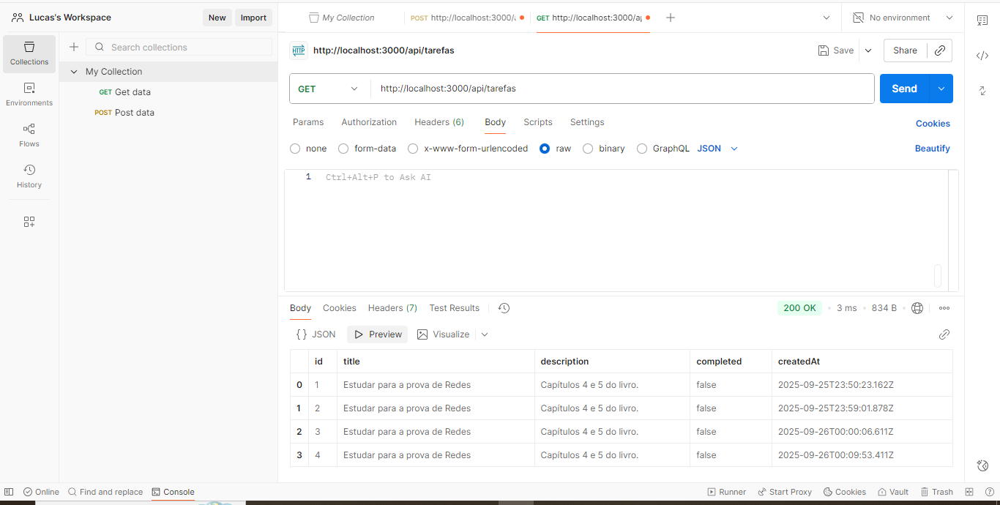
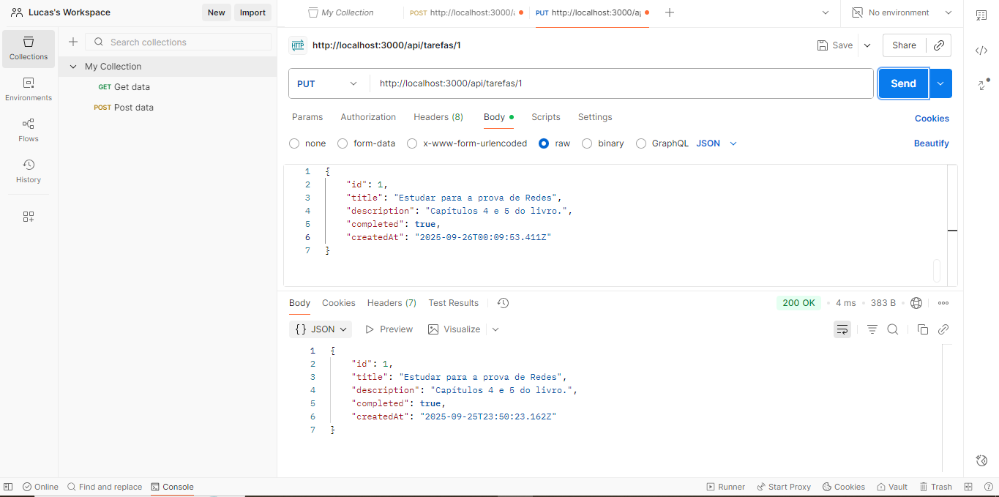
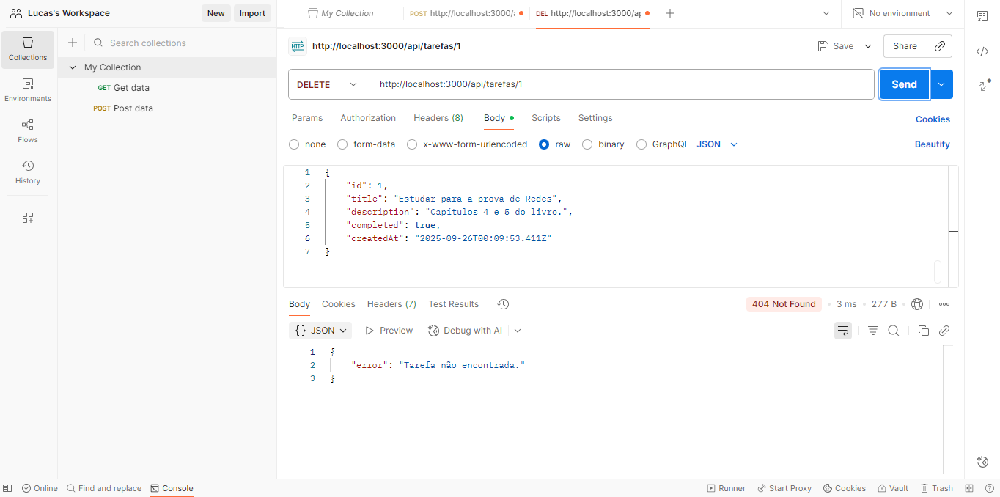

# API de Lista de Tarefas (To-Do List)

## 1. Descrição do Projeto
Esta é uma API REST simples, desenvolvida em Node.js com Express, feita pelo aluno Lucas Soares Corsino, para gerenciar uma lista de tarefas. O projeto foi criado como parte do trabalho de recuperação da disciplina de Desenvolvimento Web e implementa as funcionalidades básicas de um CRUD (Create, Read, Update, Delete) para tarefas, com armazenamento de dados em memória.

## 2. Pré-requisitos
Antes de começar, você vai precisar ter instalado em sua máquina:
* [Node.js](https://nodejs.org/) (versão 18.x ou superior recomendada)
* [npm](https://www.npmjs.com/) (geralmente vem instalado com o Node.js)
* [Postman](https://www.postman.com/) (para testar os endpoints da API)

## 3. Instruções para Instalação e Execução

1.  **Clone o repositório** (ou baixe os arquivos para uma pasta em seu computador).

2.  **Acesse a pasta do projeto** pelo terminal:
    ```bash
    cd caminho/para/projeto-tarefas
    ```

3.  **Instale as dependências** necessárias executando o comando:
    ```bash
    npm install
    ```

4.  **Inicie o servidor** com o seguinte comando:
    ```bash
    npm start
    ```
    O terminal deverá exibir a mensagem: `Servidor rodando na porta http://localhost:3000`

## 5. Rotas Disponíveis da API

A URL base para todas as rotas é `http://localhost:3000/api`.

| Método | Rota                | Descrição                                 |
| :----- | :------------------ | :---------------------------------------- |
| `POST` | `/tarefas`          | Cria uma nova tarefa.                     |
| `GET`  | `/tarefas`          | Lista todas as tarefas cadastradas.       |
| `PUT`  | `/tarefas/:id`      | Atualiza uma tarefa existente pelo seu ID.|
| `DELETE`| `/tarefas/:id`      | Exclui uma tarefa existente pelo seu ID.  |

## 6. Exemplo de JSON para Requisições

Para criar (`POST`) ou atualizar (`PUT`) uma tarefa, você deve enviar um JSON no corpo (body) da requisição.

**Exemplo para criar uma tarefa:**
```json
{
  "title": "Estudar para a prova de Redes",
  "description": "Capítulos 4 e 5 do livro."
}
```

**Exemplo para atualizar uma tarefa (PUT):**
Você pode enviar apenas os campos que deseja alterar.
```json
{
  "completed": true
}
```

## 7. Como Testar no Postman

1.  Abra o Postman e crie uma nova requisição.
2.  **Para Criar (POST):**
    * Selecione o método `POST`.
    * Insira a URL: `http://localhost:3000/api/tarefas`.
    * Vá para a aba `Body`, selecione `raw` e `JSON`.
    * Cole o JSON de exemplo acima e clique em `Send`.
3.  **Para Listar (GET):**
    * Selecione o método `GET`.
    * Insira a URL: `http://localhost:3000/api/tarefas` e clique em `Send`.
4.  **Para Atualizar (PUT):**
    * Selecione o método `PUT`.
    * Insira a URL, substituindo `:id` pelo ID da tarefa que deseja atualizar (ex: `http://localhost:3000/api/tarefas/1`).
    * Vá para a aba `Body`, selecione `raw` e `JSON`, e insira os dados que quer mudar. Clique em `Send`.
5.  **Para Deletar (DELETE):**
    * Selecione o método `DELETE`.
    * Insira a URL, substituindo `:id` pelo ID da tarefa que deseja deletar (ex: `http://localhost:3000/api/tarefas/1`). Clique em `Send`.

---
## Prints dos Testes no Postman
**1. Rota POST /tarefas (Criar Tarefa)**


**2. Rota GET /tarefas (Listar Tarefas)**


**3. Rota PUT /tarefas/:id (Atualizar Tarefa)**


**4. Rota DELETE /tarefas/:id (Deletar Tarefa)**
